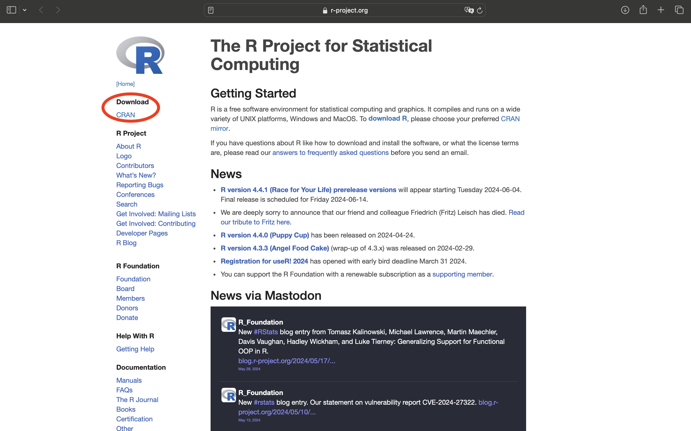
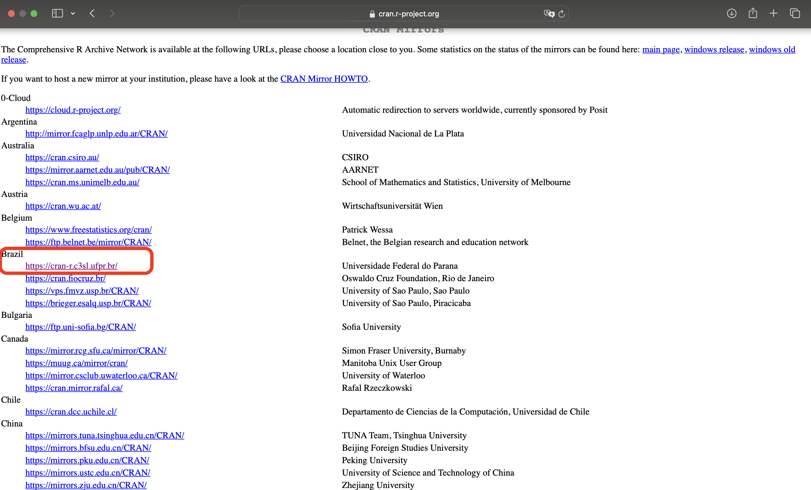
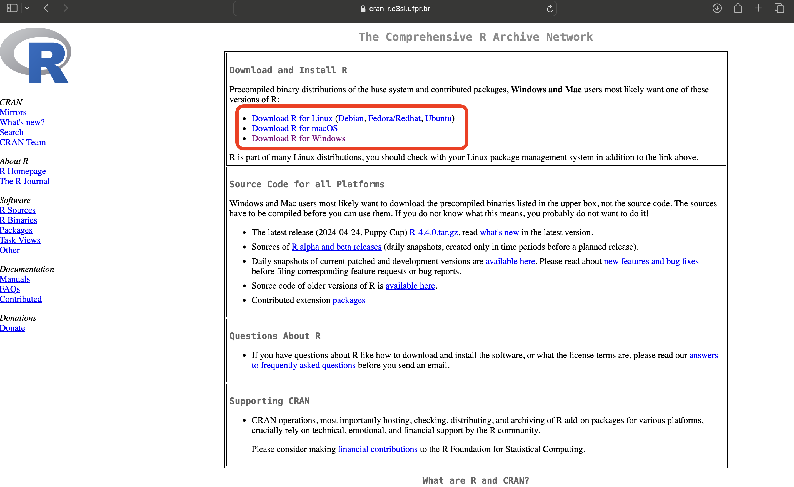
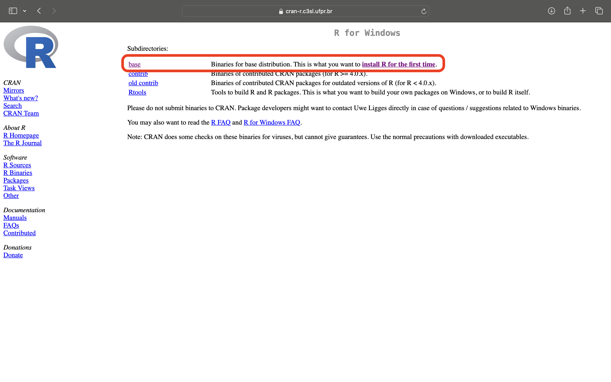
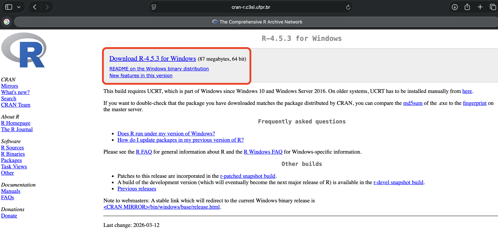
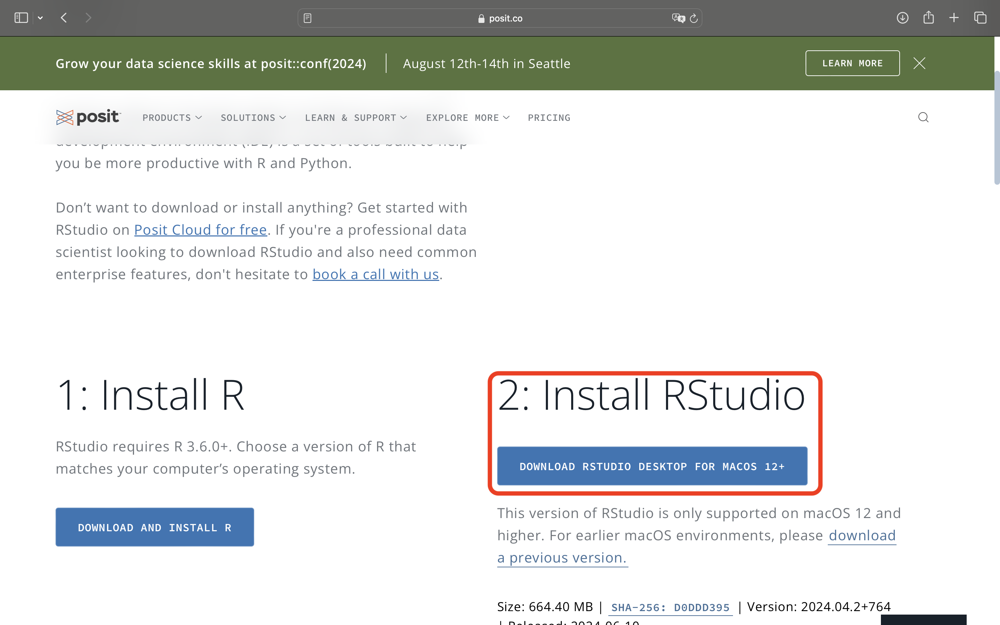

------------------------------------------------------------------------

## Técnicas Experimentais

-   **Professores:**

    -   Inês Cristina de B. Fonseca $\quad$ **E-mail**: [inescbf\@uel.br](inescbf@uel.br)

    Centro de Ciências Agrárias

    -   Guilherme Biz $\quad$ **E-mail**: [gbiz\@uel.br](gbiz@uel.br)

    Centro de Ciência Exatas - Depto de Estatística - Sala 17

    **Telefone**: 3371-4934

-   **Horário de atendimento**:

    Terças-feiras, das 14h00 às 16h45.

## Técnicas Experimentais

**Cargar horária**

\begin{array}{|cc|c|} \hline

\mbox{Teórica} & \mbox{Prática} & \mbox{Total} \\ \hline

120 & 0 & 120\\ \hline

\end{array}

**Ementa**

:::: {style="text-align: justify;"}
::: {style="text-align: justify;"}
Estatística Descritiva. Distribuição Normal. Estimação. Teste de Hipóteses. Planejamento Estatístico de Experimentos em Agronomia. Análise de variância e testes de comparação de médias. Delineamentos experimentais em pesquisas em Agronomia. Regressão e Correlação.
:::
::::

## Objetivos da Disciplina

**Capacitar os alunos à**:

::: {style="text-align: justify;"}
1.  ::: {style="text-align:justify;"}
    Desenvolver conteúdos básicos de Estatística aplicados às Ciências Agrárias.
    :::

2.  ::: {style="text-align:justify;"}
    Interpretar dados agronômicos por meio de tabelas, gráficos e medidas descritivas.
    :::

3.  ::: {style="text-align:justify;"}
    Tomar decisões fundamentadas diante de incertezas relacionadas à Agronomia.
    :::

4.  ::: {style="text-align:justify;"}
    Interpretar e planejar pesquisar ou experimentos com conhecimento estatístico.
    :::
:::

## Conteúdo Programático

<br>

::::: columns
::: {.column width="48%" style="font-size: 34px;"}
-   (19/03) Apres. da Disc. Intro. à estatística.

-   (26/03) Est. Descritiva. Uso do R.

-   (02/04) V. A.. Inferência. Uso do R.

-   (09/04) T.H.. Uso do R.

-   (16/04) Avaliação.

-   (23/04) Plan. Exp.. Uso do R.

-   (30/04) DIC.

-   (07/05) TCM. Uso do R.
:::

::: {.column width="52%" style="font-size: 34px;"}
-   (14/05) DBC. Uso do R.

-   (21/05) Exp. Fatoriais. Uso do R.

-   (28/05) Exp. Fatoriais. Uso do R.

-   (11/06) Ex. Par. Sub.. Uso do R.

-   (18/06) Regressão. Uso do R.

-   (25/06) Grupos de Exp.. Uso do R.

-   (02/07) Avaliacão.
:::
:::::

## Procedimentos de Ensino

<br><br>

-   Aulas teóricas expositivas com resolução de exercícios.

    <br><br>

-   Uso do computador para a aplicação da teoria no programa R.

## Formas e critérios de avaliações

::: {style="text-align: justify; font-size:36px;"}
Serão realizadas duas avaliações (A) com o mesmo peso,  sendo a média final da disciplina calculada por meio da média aritmética.
:::

$$
Média=\frac{A_1+A_2}{2}
$$

**Data das avaliações**

|            |            |
|:----------:|:----------:|
|  Prova 1   |  Prova 2   |
| 16/04/2026 | 02/07/2026 |

## Bibliografia Básica

<br>

::: {style="text-align: justify;"}
ANDRADE, D. O.; OGLIARI, P. J. Estatística para as Ciências Agrárias e Biológicas: com Noções de Experimentação. 3ª ed. - Florianópolis: Ed da UFSC, 2017. 475p

<br>

BANZATTO, D. A.; KRONKA, S. N. Experimentação Agrícola. 4. ed. Jaboticabal: FUNEP, 2013.

<br>

BARBIN, D. Planejamento e Análise Estatística de Experimentos Agronômicos. 2. ed. rev. ampl. - Londrina: Mecenas, 2013. 214p.
:::

------------------------------------------------------------------------

### O que é Estatística

<br>

::: {style="text-align: justify;"}
-   "Estatística é a arte e ciência de coletar, analisar e interpretar dados"

    <br>

-   R. A. Fisher definiu a estatística como a matemática aplicada aos dados de observação.

    <br>

-   "A estatística é uma ciência da tomada de decisão diante de incertezas"
:::

------------------------------------------------------------------------

### O que é Estatística?

::: {style="text-align: justify;"}
-   Três tipos fundamentais de investigação estatística:

    -   Pesquisas de opnião pública.

    -   Experimentação.

    -   Estudos observacionais.

-   ::: {style="text-align:justify;"}
    As análises estatísticas dependem da forma como os dados são coletados, e o planejamento estatístico da pesquisa indica o esquema sob o qual os dados serão obtidos.
    :::

-   ::: {style="text-align:justify;"}
    "O pensamento estatístico será um dia tão necessário para o cidadão quanto a habilidade de ler e escrever" (Well, H. G., 1993)
    :::
:::

------------------------------------------------------------------------

### Planejamento de uma pesquisa

::: {style="font-size: 30px;"}
1.  Planejamento
    -   Problemas reais ou curiosidade
2.  Perguntas
    -   Formular hipóteses

    -   Avaliar informações existentes

    -   Planejar mecanismo de coleta de dados
3.  Coleta de dados
4.  Análise estatística e apresentação dos resultados
5.  Conclusão
    -   Respondeu todas as perguntas iniciais
    -   Tomada de decisões
:::

------------------------------------------------------------------------

### Conceitos introdutórios

<br>

-   ::: {style="text-align:justify;"}
    **População**: é o conjunto de todos os elementos (indivíduos) que possuam pelo menos uma característica comum.
    :::

    -   ::: {style="text-align:justify;"}
        **Parâmetro**: é uma medida numérica que descreve uma característica de uma população.
        :::

    <br>

-   **Amostra**: é um subconjunto da população.

    -   ::: {style="text-align:justify;"}
        **Estatística**: é uma medida numérica que descreve uma característica de uma amostra.
        :::

------------------------------------------------------------------------

### Conceitos introdutórios

<br>

-   ::: {style="text-align:justify;"}
    **Unidade Observável**: é portador da(s) característica(s), ou propriedade(s), que deseja-se investigar.
    :::

-   ::: {style="text-align:justify;"}
    **Variável**: é um atributo, mensurável ou não, sujeito à variação quantitativa ou qualitativa, no interior de uma população ou amostra.
    :::

-   ::: {style="text-align:justify;"}
    **Dados**: são informações inerentes às variáveis que caracterizam os elementos que constituem a população ou a amostra em estudo.
    :::

------------------------------------------------------------------------

### Tipos de variáveis

<br>

-   Qualitativas
    -   Nominal
    -   Ordinal

<br>

-   Quantitativa
    -   Discreta

    -   Contínua

------------------------------------------------------------------------

### Censo ou amostragem

<br>

**Plano de amostragem**: procedimento utilizado para selecionar a amostra.

**Censo**: tentativa de amostrar toda a população.

<br>

**Vantagens da amostragem sobre o censo**

-   Custo reduzido

-   Tempo

-   Aprofundamento na pesquisa

------------------------------------------------------------------------

### Amostragem Simples ao Acaso - Probabilística

<br>

-   ::: {style="text-align:justify;"}
    É um método de selecionar, sem reposição, $n$ elementos de uma população, em que todo elemento da população tem probabilidade igual de ser escolhido para a amostra.
    :::

    <br>

-   ::: {style="text-align:justify;"}
    **Utilização**: utiliza-se este tipo de amostragem quando a população pode ser considerada homogênea.
    :::

------------------------------------------------------------------------

### Amostragem Sistemática - Probabilística

::: {style="font-size: 34px;"}
-   ::: {style="text-align:justify;"}
    Os elementos são escolhidos utilizando-se algum tipo de sistema. Para o processo de coleta, divide-se o tamanho da população pelo tamanho da amostra, obtendo-se o "salto". $$s=\frac{N}{n}$$ Sorteia-se um número entre 1 e $s$. A partir daí, basta ir somando $s$ à posição do elemento retirado.
    :::

-   **Utilização**: utiliza-se este tipo de amostragem quando a população está naturalmente ordenada, como fichas em fichário, listas telefônicas,etc.
:::

------------------------------------------------------------------------

### Amostragem Estratificada - Probabilística

<br>

-   ::: {style="text-align:justify;"}
    É um tipo de amostragem realizado quando a população for heterogênea. Para obter-se uma amostra é preciso dividir a população em grupos de elementos homogêneos, chamados de estratos e, nestes estratos, sortear seus elementos.
    :::

-   ::: {style="text-align:justify;"}
    **Utilização**:utiliza-se este tipo de amostragem quando a população é heterogênea.
    :::

------------------------------------------------------------------------

### Amostragem por Conveniência - Não probabilística

<br>

-   ::: {style="text-align:justify;"}
    É o tipo de amostragem em que o pesquisador seleciona os membros da população dos quais é mais fácil obter informações.
    :::

-   Bastante utilizado na área de marketing.

-   ::: {style="text-align:justify;"}
    É importante o senso crítico do pesquisador para evitar vieses.
    :::

------------------------------------------------------------------------

### Amostragem por Quota - Não probabilística

<br>

-   ::: {style="text-align:justify;"}
    Este tipo de amostragem assemelha-se, numa fase inicial, com a amostragem estratificada proporcional. A população é dividida em grupo e, seleciona-se, para fazer parte amostral, uma quota de cada grupo, proporcional a seu tamanho.
    :::

-   Muito utilizado em prévias eleitorais.

-   ::: {style="text-align:justify;"}
    Amostragem não probabilística, geralmente é influenciada por tendência, preferências e fatores subjetivos pessoais diversos.
    :::

------------------------------------------------------------------------

### Dimensionamento da amostra

::: {style="font-size: 36px;"}
-   A determinação do tamanho da amostra depende de alguns fatores:

    1.  **Tamanho da população**: finita ($N$) ou infinita.

    2.  ::: {style="text-align:justify;"}
        **Variância ou percentual**: dependendo do tipo de pesquisa, usa-se a variância ou a percentagem.
        :::

    3.  ::: {style="text-align:justify;"}
        **Nível de confiança**: probabilidade de acerto, geralmente 95% ou 99%.
        :::

    4.  ::: {style="text-align:justify;"}
        **Informações na literatura**: Informações sobre $\pi$ ou sobre $\sigma^2$.
        :::

    5.  **Erro de amostragem ou precisão**: margem de erro.
:::

------------------------------------------------------------------------

### Determinação do tamanho amostral para variáveis qualitativas

<br>

:::: {style="font-size: 34px;"}
::: {style="text-align:justify;"}
Quando se dispõe de variáveis qualitativas, utiliza-se a seguinte formula: $$ n_0=\frac{z^2\pi(1-\pi)}{(\pi-p)^2}=\frac{z^2\pi(1-\pi)}{\epsilon^2},$$ para população infinita, em que $\epsilon$= erro de precisão, $\pi$= valores obtidos em trabalhos anteriores, $z$= nível de confiança e $n_0$= amostra inicial.
:::
::::

------------------------------------------------------------------------

### Determinação do tamanho amostral para variáveis quantitativas

::: {style="font-size: 34px;"}
Quando se dispõe de variáveis quantitativas, utiliza-se a seguinte fórmula: $$ n_0=\frac{z^2\sigma^2}{\epsilon^2},$$ para população infinita, em que $\sigma^2$ representa a variância da variável de interesse, obtida em estudos anteriores.

**OBS**:Em ambos os casos, se a população é finita deve-se utilizar também a equação: $$n=\frac{n_0}{1+\frac{n_0}{N}}.$$
:::

------------------------------------------------------------------------

## Introdução ao R

::: {style="font-size: 34px;"}
-   ::: {style="text-align: justify;"}
    R é uma linguagem e ambiente para computação estatística e gráfica.
    :::

-   ::: {style="text-align: justify;"}
    O R é um sistema desenvolvido a partir da linguagem S, que tem suas origens nos laboratórios da AT&T no final dos anos 1980. Posteriormente o S foi vendido e deu origem a uma versão comercial, o S-Plus.
    :::

-   ::: {style="text-align: justify;"}
    Em 1995 dois professores (Robert Gentleman e Ross Ihaka) da Universidade de Auckland, na Nova Zelândia, iniciaram o “Projeto R” (porque R vem depois de S), com o intuito de desenvolver um programa estatístico poderoso baseado na linguagem S, e de domínio público. O R pode ser baixado gratuitamente em <https://www.r-project.org>.
    :::
:::

------------------------------------------------------------------------

### Introdução ao R

<br>

::: {style="font-size: 34px;"}
-   ::: {style="text-align: justify;"}
    Sendo um Software Livre, os códigos fontes do R estão disponíveis e atualmente são gerenciados por um grupo chamado o Core Development Team <https://www.r-project.org/contributors.html>. A vantagem de ter o código aberto é que falhas podem ser detectadas e corrigidas rapidamente e atualizações para Softwares Livres podem ser disponibilizadas em uma questão de dias.
    :::

-   ::: {style="text-align: justify;"}
    R é fornecido como um programa com interface de linhas de comando, que é o preferido por usuários experientes porque permite controle direto nos cálculos e é flexível.
    :::
:::

------------------------------------------------------------------------

<br>

::: {style="font-size: 34px;"}
-   ::: {style="text-align: justify;"}
    O aprendizado para interface de linha de comandos é mais longa do que com interface gráfica, mas é reconhecida como um esforço recompensável e leva a melhoras práticas (melhor compreensão do plano de análise; comandos facilmente salvos e substituídos e mantém uma rastreabilidade das edições realizadas).
    :::

-   ::: {style="text-align: justify;"}
    A interface com o usuário é a maior diferença entre o R e S-PLUS e outros programas de análise. Há diversas iniciativas de interfaces gráficas para o R, mas a maioria dos desenvolvedores dessas interfaces declara que essas são para familiarização da linguagem para o iniciante e provavelmente por isso nenhuma delas é completa
    :::
:::

------------------------------------------------------------------------

### Download do R

<br>

1.  Acessar o site <https://www.r-project.org> e clicar em CRAN.

2.  Escolher um servidor. Hoje no Brasil existem três servidores.

3.  Escolher a versão de download que seja compatível com seu sistema operacional. Neste caso "Download R for Windows".

4.  Clique em "Install R for the first time''.

5.  Clique em "Download R 4.4.3 for Windows''.

------------------------------------------------------------------------

Acessar o site <https://www.r-project.org> e clicar em CRAN.



------------------------------------------------------------------------

Escolher um servidor



------------------------------------------------------------------------

Escolher o sistema operacional



------------------------------------------------------------------------

Clique em "install R for the first time".



------------------------------------------------------------------------

Download R (Versão mais nova) for Windows



## Rstudio

<br>

-   Para fazer o download do Rstudio acesse o site: <https://posit.co/download/rstudio-desktop/>

    <br>

-   Uma opção é a versão online. Site: <https://posit.cloud>

------------------------------------------------------------------------

Download RStudio



------------------------------------------------------------------------

RStudio Cloud


------------------------------------------------------------------------

#### Informações Básicas do R

-   Para detalhes sobre a licença do R.

    ``` r
    license()
    ```

-   Para saber como citar o R.

    ``` r
    citation()
    ```

-   Para ter demostranções no R.

    ``` r
    demo()
    ```

-   Pedindo ajuda no R.

    ``` r
    help()
    help.start()
    ```
